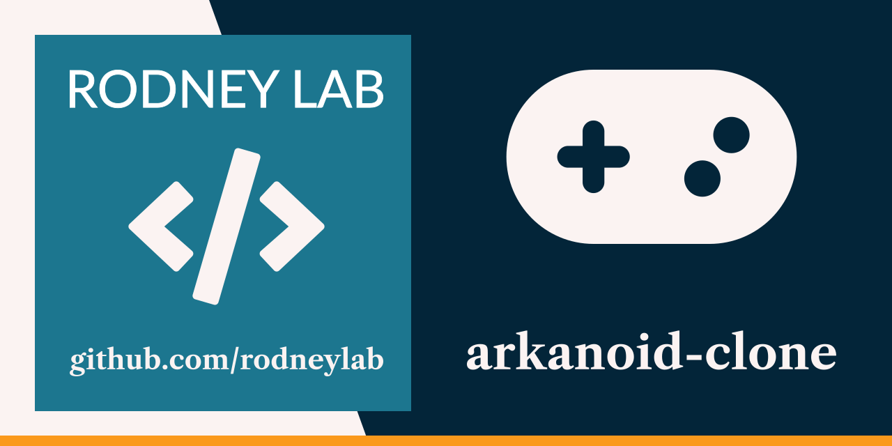

<p align="center">
  <a aria-label="Open Rodney Lab site" href="https://rodneylab.com" rel="nofollow noopener noreferrer">
    
  </a>
</p>
<h1 align="center">
  Arkanoid Clone
</h1>

# arkanoid-clone

Arkanoid clone built in C++ with SFML, and based on
[Vittorio Romeo tutorial](https://www.youtube.com/watch?v=_4K3tsKa1Uc).

## Usage

Requires [CMake](https://cmake.org/getting-started/) and a C++ compiler.

Clone the repo then run:

```shell
cmake . -B build
cmake --build build
./build/bin/Arkanoid
```

In game, use the left and right arrow keys to move the paddle at the bottom of
the screen.

## Issues

Feel free to jump into the
[Rodney Lab matrix chat room](https://matrix.to/#/%23rodney:matrix.org).
